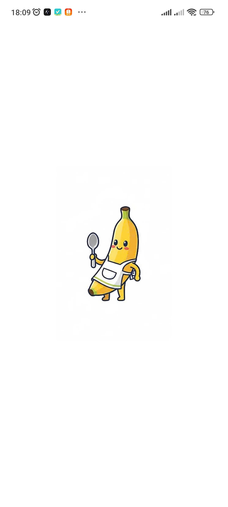
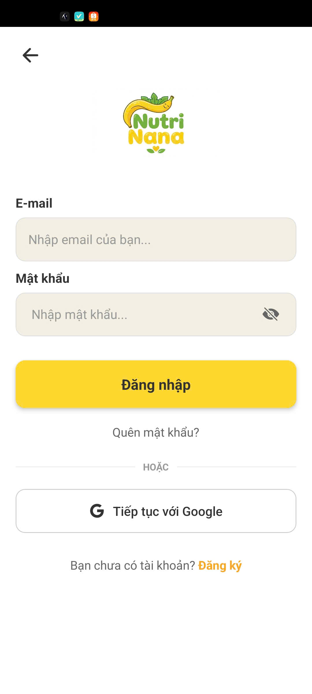
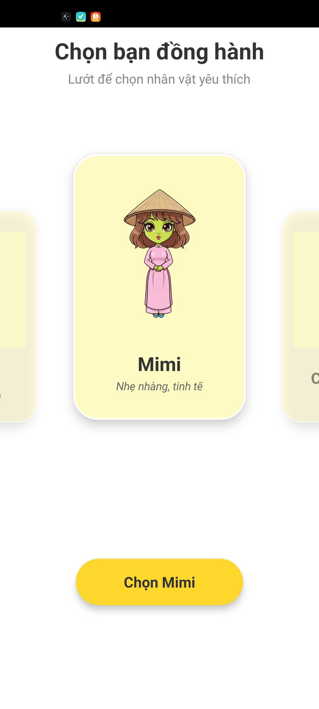
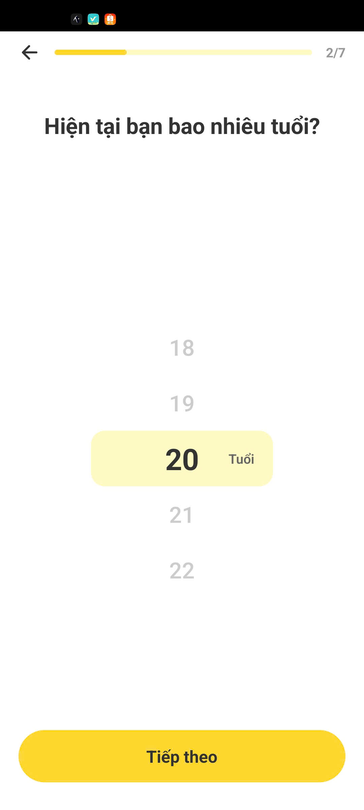
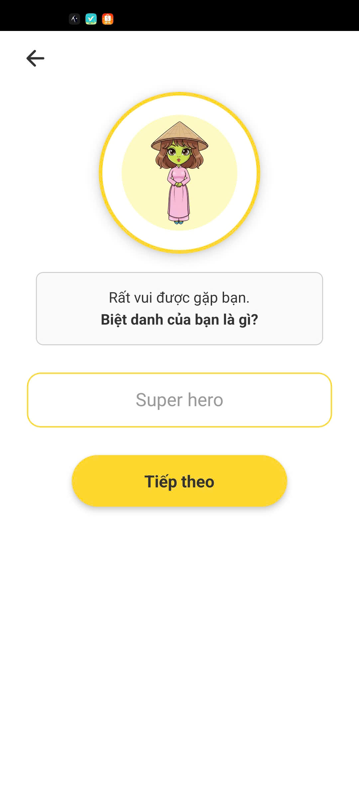
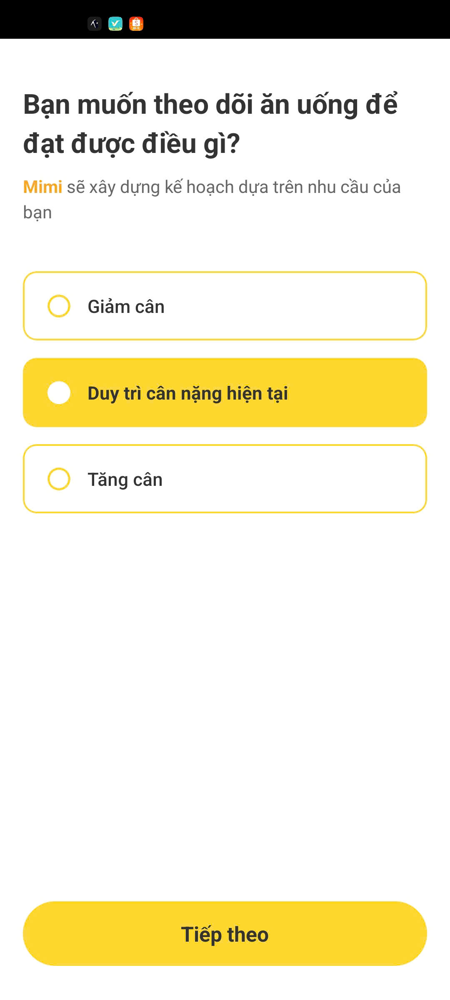
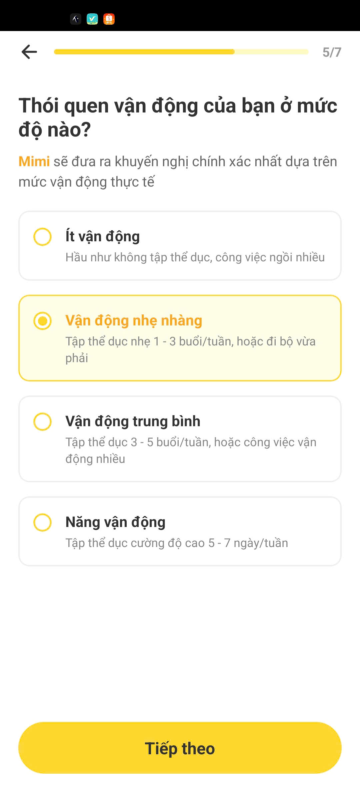
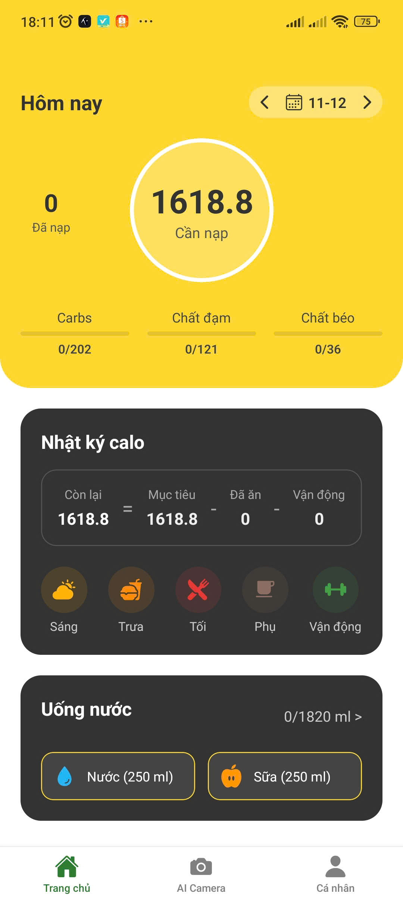
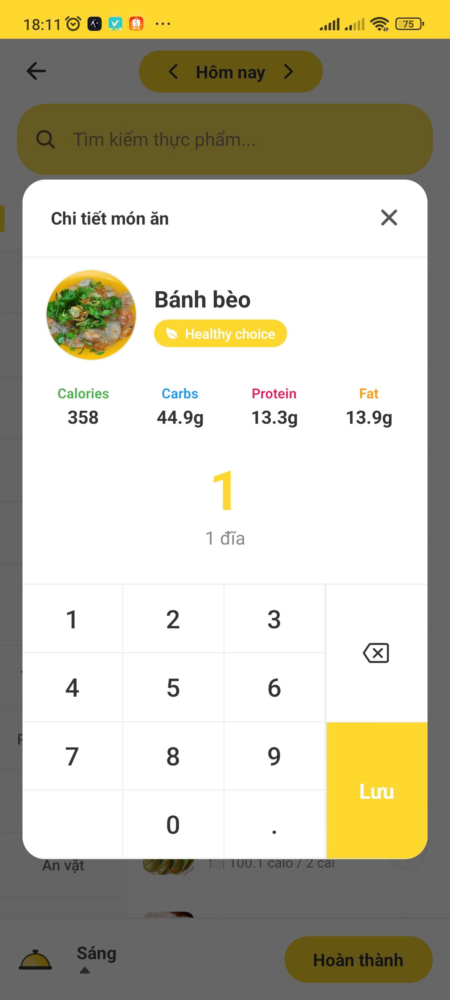
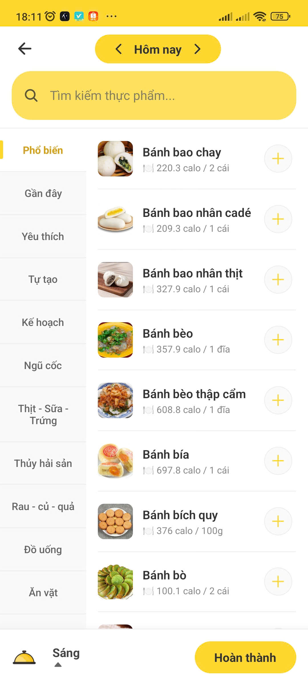

\# 🍌 NutriNana App

Dự án ứng dụng di động hỗ trợ quản lý dinh dưỡng và sức khỏe cá nhân, được xây dựng bằng \*\*React Native (Expo)\*\* và tích hợp \*\*AI Backend\*\*.

\## 📸 Giao diện Demo

\### 1. Màn hình Chào mừng \& Đăng nhập

| Welcome | Đăng nhập |

|:---:|:---:|

|  |  |

\### 2. Thiết lập Hồ sơ Cá nhân

| Nhân vật | Giới tính | Tuổi | Biệt danh | Mục tiêu | Vận động |

| :---: |:---:|:---:|:---:|:---:|:---:|

| |  |  |  |  |  |

\### 3. Tính năng chính

| Trang chủ | Chi tiết món ăn | Thêm món |

|:---:|:---:|:---:|

|  |  | |

---

\## 📂 Cấu trúc dự án

\- \*\*mobile-app/\*\*: Source code chính.

\- \*\*ai-backend/\*\*: Server AI Python.

